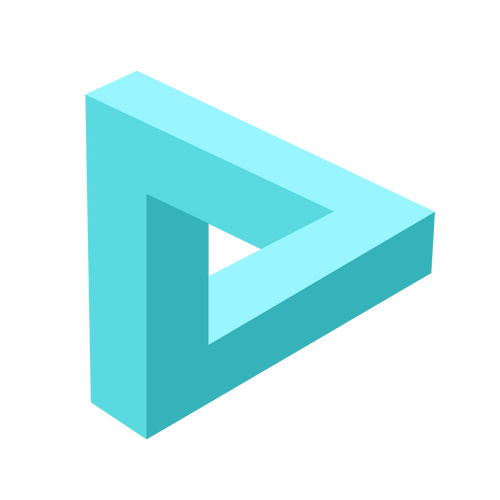

# Awesome Flojoy 

> A curated list of awesome things related to Flojoy

## Contents

- [Studio Apps](#studio-apps)

## Studio Apps

Here are some awesome apps that you can start using with Flojoy Studio.

The easiest way to get started with those apps is by downloading the
[Flojoy Studio](https://docs.flojoy.ai/studio/installation/) desktop app, and
you will be able to load these apps directly using the `App Gallery` function
inside of Flojoy Studio.

### Apps for Oscilloscopes

- [Decode I2C data](https://docs.flojoy.ai/blocks/hardware/oscilloscopes/tektronix/mso2x/decode-i2c-mso2x/)
- [Rigol: Extract & plot traces](https://docs.flojoy.ai/blocks/hardware/oscilloscopes/rigol/ds1074z/extract-trace-ds1074z/)
- [LeCroy: Extract & plot traces](https://docs.flojoy.ai/blocks/hardware/oscilloscopes/teledyne-lecroy/t3dso1xxx/measurement-t3dso1xxx/)
- [Pico: Extract & plot traces](https://docs.flojoy.ai/blocks/hardware/oscilloscopes/pico/pico2000/extract-trace-2000/)
- [Tektronix: Extract & plot traces](https://docs.flojoy.ai/blocks/hardware/oscilloscopes/tektronix/mdo3xxx/advanced-measurements-mdo3xxx/)

## Contribute

Contributions welcome! Read the [contribution guidelines](contributing.md) first.
